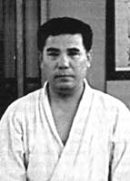

")
")

")

---

+ [Silabario](https://alfredo-arias.github.io/silabario "Silabario")
+ [Katas](https://alfredo-arias.github.io/katas "Katas")
+ [Dojo](https://alfredo-arias.github.io/dojo "Dojo")
+ [Las 7 virtudes del bushido](https://alfredo-arias.github.io/las-7-virtudes-del-bushido "Las 7 virtudes del bushido")
+ [OSS, El Saludo del karate](https://alfredo-arias.github.io/oss-el-saludo-del-karate "OSS, el saludo del karate")
+ [Catálogo de técnicas](https://alfredo-arias.github.io/tecnicas "Técnicas")